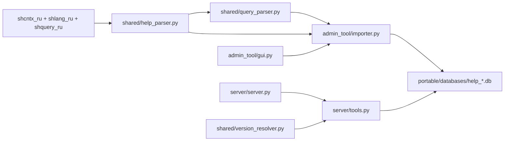

## Архитектура

### Поток данных (high level)

### Основные компоненты

- **Парсер справки**: `shared/help_parser.py` + `shared/query_parser.py`
  - Вход: корневая папка с `shcntx_ru`, `shlang_ru` и/или `shquery_ru` (распакованные `.hbk`).
  - Выход BSL: объекты платформы, методы/свойства, типы и конструкции языка.
  - Выход запросов: ключевые слова, функции, предложения, операторы (`category`: `query_*`).
  - `parent_name` в БД хранит `topic_id` файла (`WhereStatement`, `ISNULL`).

- **Построение SQLite**: `admin_tool/importer.py` + `shared/db_manager.py`
  - Одна БД на версию платформы: `help_8_3_27.db`.
  - FTS5 (`help_search`) для полнотекстового поиска BSL и запросов.
  - `meta.has_query_help`, `meta.query_topics_count` — наличие справки по запросам.

- **MCP сервер**: `server/server.py` — 9 инструментов (6 BSL + 3 query).

- **Инструменты**: `server/tools.py` — BSL tools и отдельные `get_query_syntax`, `search_query`, `list_query_topics`.

### Runtime vs исходники

| | Исходники (репозиторий) | Portable (соседняя папка) |
|---|---|---|
| Код | `admin_tool/`, `server/`, `shared/` | `Admin/`, `Server/` (exe) |
| Базы | не хранятся | `databases/*.db` |
| Конфиг | `config.json` (`databases_dir: databases`) | `config.json` (`databases_dir: ../databases`) |

Сборка: `build_all.bat` → `../1c_help_mcp_server_Portable/`. Пути в коде **относительные**; после переноса portable обновите `command` в конфиге MCP-клиента.
