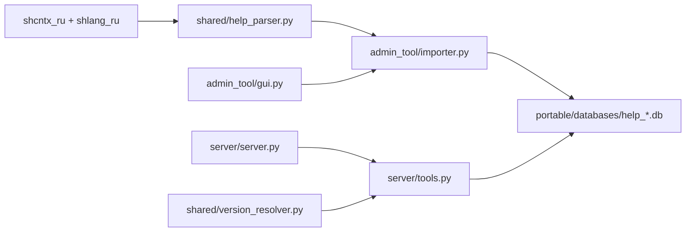

## Архитектура

### Поток данных (high level)

### Основные компоненты

- **Парсер справки**: `shared/help_parser.py`
  - Вход: корневая папка с `shcntx_ru` и/или `shlang_ru` (распакованные `.hbk`).
  - Выход: объекты платформы, методы/свойства, типы и конструкции языка.
  - Методы обогащаются из HTML-страниц (в т.ч. вложенные каталоги `methods/catalog*/`).

- **Построение SQLite**: `admin_tool/importer.py` + `shared/db_manager.py`
  - Одна БД на версию платформы: `help_8_3_27.db`.
  - FTS5 (`help_search`) для полнотекстового поиска.

- **MCP сервер**: `server/server.py` — регистрация 6 инструментов.

- **Инструменты**: `server/tools.py` — запросы к SQLite, выбор версии через `shared/version_resolver.py`.

### Runtime vs исходники

| | Исходники (репозиторий) | Portable (соседняя папка) |
|---|---|---|
| Код | `admin_tool/`, `server/`, `shared/` | `Admin/`, `Server/` (exe) |
| Базы | не хранятся | `databases/*.db` |
| Конфиг | `config.json` (`databases_dir: databases`) | `config.json` (`databases_dir: ../databases`) |

Сборка: `build_all.bat` → `../1c_help_mcp_server_Portable/`. Пути в коде **относительные**; после переноса portable обновите `command` в конфиге MCP-клиента.
