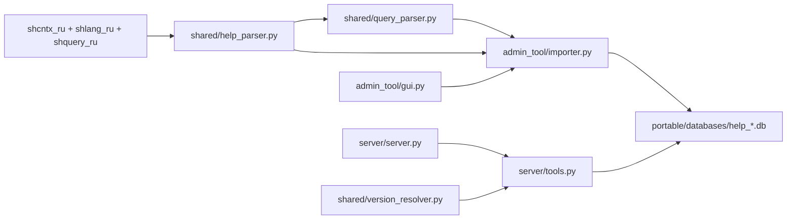
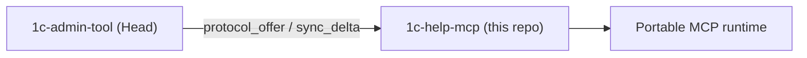

## Architecture

### Data flow (high level)

### Main components

- **Help parser**: `shared/help_parser.py` + `shared/query_parser.py`
  - Input: root folder with `shcntx_ru`, `shlang_ru`, and/or `shquery_ru` (extracted `.hbk`).
  - BSL output: platform objects, methods/properties, language types and constructs.
  - Query output: keywords, functions, clauses, operators (`category`: `query_*`).
  - `parent_name` in the DB stores the file `topic_id` (`WhereStatement`, `ISNULL`).

- **SQLite build**: `admin_tool/importer.py` + `shared/db_manager.py`
  - One DB per platform version: `help_8_3_27.db`.
  - FTS5 (`help_search`) for full-text BSL and query search.
  - `meta.has_query_help`, `meta.query_topics_count` — query help availability.

- **MCP server**: `server/server.py` — 9 tools (6 BSL + 3 query).

- **Tools**: `server/tools.py` — BSL tools and separate `get_query_syntax`, `search_query`, `list_query_topics`.

### Runtime vs sources

| | Sources (repository) | Portable (sibling folder) |
|---|---|---|
| Code | `admin_tool/`, `server/`, `shared/` | `Admin/`, `Server/` (exe) |
| Databases | not stored | `databases/*.db` |
| Config | `config.json` (`databases_dir: databases`) | `config.json` (`databases_dir: ../databases`) |

Build: `build_all.bat` → `../1c_help_mcp_server_Portable/`. Paths in code are **relative**; after moving portable, update `command` in the MCP client config.

### Position in the group (Sub)

- **Runtime** — fully autonomous: Admin + MCP Server + SQLite, no Hub required.
- **Documentation and managed-tool contract** — synced with Head via `docs/group/inbox|outbox/` (see [`group/integration.md`](group/integration.md)).
- Sub does **not** store the shared protocol canon; baseline appears in `docs/group/protocol-ref/epoch<N>/` after reconcile.
