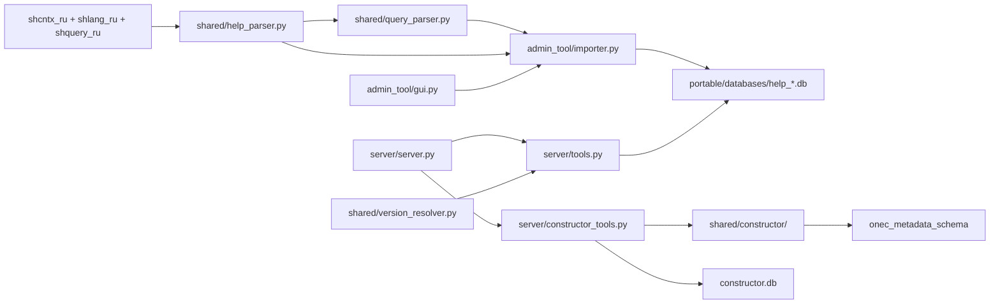
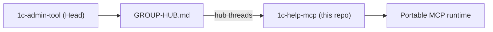

## Architecture

### Data flow (high level)

### Main components

- **Help parser**: `shared/help_parser.py` + `shared/query_parser.py`
  - Input: root folder with `shcntx_ru`, `shlang_ru`, and/or `shquery_ru` (extracted `.hbk`).
  - BSL output: platform objects, methods/properties, language types and constructs.
  - Query output: keywords, functions, clauses, operators (`category`: `query_*`).
  - `parent_name` in the DB stores the file `topic_id` (`WhereStatement`, `ISNULL`).

- **SQLite build**: `admin_tool/importer.py` + `shared/db_manager.py`
  - One DB per platform version: `help_8_3_27.db`.
  - FTS5 (`help_search`) for full-text BSL and query search.
  - `meta.has_query_help`, `meta.query_topics_count` — query help availability.

- **MCP server**: `server/server.py` — 24 tools (6 BSL + 3 query + 15 constructor: 6 processor + 9 report). Report tools split by `create_report(kind=...)`: `skd` (`set_report_skd`) or `macet` (`set_report_attributes`/`set_report_tabular_sections`/`set_report_form`/`set_report_template`) — see `docs/mcp-tools.md`.

- **Tools**: `server/tools.py` — BSL and query tools; `server/constructor_tools.py` — metadata constructor.

### Runtime vs sources

| | Sources (repository) | Portable (sibling folder) |
|---|---|---|
| Code | `admin_tool/`, `server/`, `shared/` | `Admin/`, `Server/` (exe) |
| Databases | not stored | `databases/*.db` |
| Config | `config.json` (`databases_dir: databases`) | `config.json` (`databases_dir: ../databases`) |

Build: `build_all.bat` → `../1c_help_mcp_server_Portable/`. Paths in code are **relative**; after moving portable, update `command` in the MCP client config.

### Position in the group (Sub)

- **Runtime** — fully autonomous: Admin + MCP Server + SQLite, no Hub required.
- **Documentation and managed-tool contract** — synced with Head via hub threads at `C:/projects/1c-admin-tool/GROUP-HUB.md` · `C:/repo/1c-config-admin-tool/GROUP-HUB.md` (skill **`sync`**; see [`group/integration.md`](group/integration.md)).
- Sub does **not** store the shared protocol canon; baseline appears in `docs/group/protocol-ref/epoch<N>/` after reconcile.

### Product policies

- **NO_DB_MIGRATIONS**: never write migrations or conversions for existing SQLite databases. After schema or import logic changes, databases are **always recreated** via `admin_tool` from help sources (see `.cursor/rules/no-db-migrations.mdc`).
- **Testing**: functional verification uses the live MCP after the user rebuilds the server and reconnects MCP in the IDE. Verification — **only via MCP tool calls**, starting with `list_help_versions`; no direct SQLite reads and no Python workaround scripts.
- **Sources vs runtime (portable)**: repository sources must not contain runtime state (`databases/*.db`). Databases live in the portable instance (`../1c_help_mcp_server_Portable/databases/`) and are created via Admin. The agent changes sources; the user rebuilds portable/server and recreates databases if needed.
- **Parser: rely on real HBK**: when extending `shared/help_parser.py` / `shared/query_parser.py`, inspect real HTML from unpacked help. Sources live outside the repo (folder with `shcntx_ru` / `shlang_ru` / `shquery_ru`).
- **BSL vs query language**: built-in language — `get_syntax`, `search_syntax`; query text (`ВЫБРАТЬ`, `ЕСТЬNULL`) — `get_query_syntax`, `search_query`, `list_query_topics`.

### Domain specs

| Document | Content |
|----------|---------|
| [`mcp-tools.md`](mcp-tools.md) | MCP tools and call examples |
| [`database.md`](database.md) | SQLite schema, no-migrations policy |
| [`testing-protocol.md`](testing-protocol.md) | Verification on a connected MCP |
