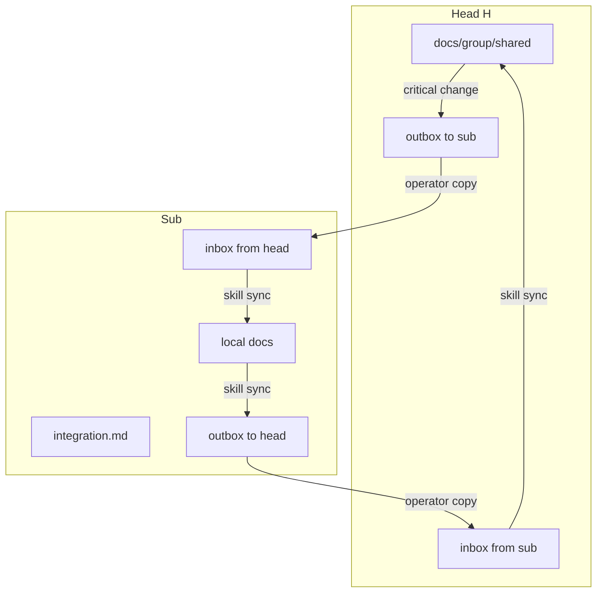

# Canon: documentation

Version: **2.2.0**

Unified documentation order for **any** project. Material in the **agent-cache tier** is **English**. Russian is allowed for **human-tier** docs and **product UI** (see below).

On conflict during translation: preserve **meaning and canon structure**, not word-for-word Russian.

---

## Language tiers

### Agent-cache tier (English)

Paths the agent reads repeatedly in the pipeline. Full list also in `<WI>/normalize.bundle.yaml` → `agent_cache_tier`.

| Scope | Paths |
|-------|-------|
| All roles | `README.md`, `AGENTS.md` |
| All roles | `docs/README.md`, `docs/agent-onboarding.md`, `docs/architecture.md`, `docs/todo.md` |
| All roles | `docs/canons/**` |
| All roles | `.cursor/skills/**`, `.cursor/agents/**` |
| Head (H) | `docs/group/README.md`, `docs/group/shared/**`, `docs/group/templates/**` |
| Sub | `docs/group/integration.md`, `docs/group/protocol-ref/**`, `docs/group/templates/**` |

**Exceptions:** files with `<!-- project-local: -->` at the top — do not translate or overwrite.

**On re-normalize:** skill **`maintain-docs`** → **`doc-librarian`** translates agent-cache paths to English (merge, not blind replace). Track `agent_docs_lang: en` in `docs/normalize-record.md`.

### Human tier (Russian OK)

Not auto-translated on normalize:

- `CHANGELOG.md`
- `docs/group/OPERATOR-HANDOFF.md`
- `docs/group/archive/` (historical negotiation records)

### Product UI (out of scope)

Russian UI strings, localization files, and UI specs under `src/` — maintained by developers; normalize does **not** touch them.

---

## Levels

---

## Root and docs/ (all types)

See `project-structure.md`. Reading order in `docs/README.md`:

1. `agent-onboarding.md`
2. `todo.md` — **including unprocessed inbox packets**
3. `architecture.md`
4. Domain specs (agent-read paths → English)
5. For **Sub**: `group/integration.md`

---

## Head vs Sub

| Topic | Head (H) | Sub |
|-------|----------|-----|
| Shared protocol canon | `docs/group/shared/` | reference; updates via packets |
| Local adaptation | — | `docs/` + `integration.md` |
| Group map | `docs/group/README.md` | link in `integration.md` |
| Sync | outbox/inbox per sub-id | inbox/outbox |

**Rule:** group-wide canon lives in Head `shared/`. Sub owns **its** direction in local specs; updates via **packets**, not by copying all of `shared/`.

---

## Sync packets (ephemeral)

Not documentation or canon — **edit instructions**. Format: `group-sync.md`, template `templates/sync-packet.example.md`.

After agent processing (skill **`sync`**) — file is **deleted**.

---

## Update policies

1. Local change → domain doc + `CHANGELOG.md`
2. Group-critical in Head → edit `shared/` → skill `sync` → outbox → operator copies to Sub inbox
3. Group-critical path in Sub → skill `sync` → outbox → operator copies to Head inbox
4. `info` changes — no packet (local CHANGELOG is enough)

---

## Checklist

- [ ] S/H/Sub type in `agent-onboarding.md`
- [ ] inbox/outbox in `.gitignore`
- [ ] Sub: no committed packets
- [ ] H: shared specs only in `shared/`
- [ ] Agent-cache tier in English (`agent_docs_lang: en` in normalize-record)
