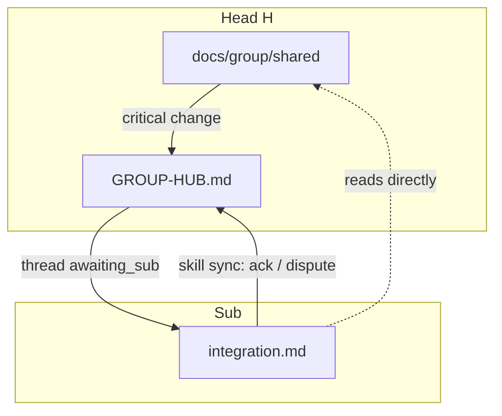

# Canon: documentation

Version: **2.4.0**

Unified documentation order for **any** project. Material in the **agent-cache tier** is **English**. Russian is allowed for **human-tier** docs and **product UI** (see below).

On conflict during translation: preserve **meaning and canon structure**, not word-for-word Russian.

---

## Language tiers

### Agent-cache tier (English)

Paths the agent reads repeatedly in the pipeline. Full list also in `<WI>/normalize.bundle.yaml` → `agent_cache_tier`.

| Scope | Paths |
|-------|-------|
| All roles | `README.md`, `AGENTS.md` |
| All roles | `docs/README.md`, `docs/agent-map.md`, `docs/architecture.md`, `docs/todo.md` |
| All roles | `docs/canons/**` |
| All roles | `.cursor/skills/**`, `.cursor/agents/**` |
| Head (H) | `docs/group/README.md`, `docs/group/shared/**` |
| Sub | `docs/group/integration.md` |

`GROUP-HUB.md` is **on-demand** (read on sync), not agent-cache tier — kept English when agent-read but outside the repeated-read list.

**Exceptions:** files with `<!-- project-local: -->` at the top — do not translate or overwrite.

**Author agent-facing docs in English from the start** — they are cached every session, and one language keeps the cache tight. Legacy repo in another language: translate agent-cache paths on normalize as a merge (see `normalize-governance.md`), then set `agent_docs_lang: en` in `docs/normalize-record.md`.

### Human tier (Russian OK)

Not auto-translated on normalize:

- `CHANGELOG.md`
- `docs/group/OPERATOR-HANDOFF.md` — credentials/deploy runbook; not auto-translated, but refreshed from template on a structural migration
- `docs/group/archive/` (historical negotiation records)

### Product UI (out of scope)

Russian UI strings, localization files, and UI specs under `src/` — maintained by developers; normalize does **not** touch them.

---

## Group sync flow (hub model)

A critical change from Sub A reaches Sub B **only through Head**. State is thread metadata in `GROUP-HUB.md`; contracts are committed in `shared/` and referenced by path + commit — Sub reads them at `head.path`, it never mirrors them.

---

## Root and docs/ (all types)

See `project-structure.md`. Reading order in `docs/README.md`:

1. `agent-map.md` — entry: directory map, delegation, sync triggers
2. `todo.md` — including `## Hub pending`
3. `architecture.md`
4. Domain specs (agent-read paths → English)
5. For **Sub**: `group/integration.md`

---

## Extended documentation & backlog

Keep additional docs in one order, not a sprawl of parallel trees:

- **One entry** — `docs/agent-map.md`. No secondary entry docs (`README_AI.md` and the like).
- **One backlog** — `docs/todo.md`. No parallel backlog/roadmap files.
- **Domain / extended docs** — named topic files under `docs/`, indexed from `architecture.md`; no duplicate copies of group `shared/` content.

Normalization **consolidates** accumulated ad-hoc documentation into this structure rather than preserving it as-is: fold the live content of agent-created files into the canonical doc and drop the rest. A file is not kept just because an agent made it. `project-local` marks only a *deliberate* deviation with a stated reason (see `normalize-merge.md`) — not sprawl.

---

## Head vs Sub

| Topic | Head (H) | Sub |
|-------|----------|-----|
| Shared protocol canon | `docs/group/shared/` | reference; updates via hub threads |
| Local adaptation | — | `docs/` + `integration.md` |
| Group map | `docs/group/README.md` | link in `integration.md` |
| Sync state | `GROUP-HUB.md` (owner) | own `sub_id` sections in Head hub |

**Rule:** group-wide canon lives in Head `shared/`. Sub owns **its** direction in local specs; it reads `shared/` at `head.path` directly rather than copying it.

---

## Update policies

1. Local change → domain doc + `CHANGELOG.md`.
2. Group-critical in Head → edit `shared/` → commit → skill `sync` opens a hub thread.
3. Group-critical for a Sub → skill `sync` responds in its hub thread; `doc-librarian` updates `integration.md`.
4. `info` changes — no thread (local CHANGELOG is enough).

---

## Checklist

- [ ] S/H/Sub type stated in `docs/agent-map.md`
- [ ] `.tasks/` in `.gitignore`
- [ ] Sub: no local copy of `shared/` (reads it at `head.path` directly)
- [ ] H: shared specs only in `shared/`; `GROUP-HUB.md` carries pointers, not contract bodies
- [ ] Agent-cache tier in English (`agent_docs_lang: en` in normalize-record)
