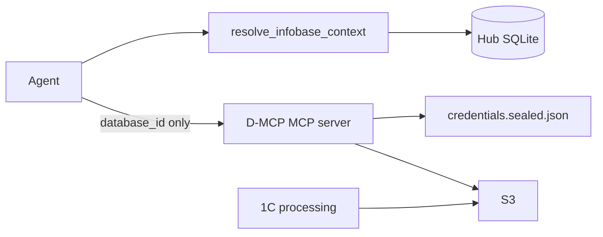

# Согласованный mapping: Hub ↔ data-mcp

**Статус:** **agreed** — Sub `protocol_ack` **2026-07-01** (`20260701T172000`) on merge `20260701T170000`; v1.0.5 ack **2026-07-02** (`20260702T180000`)  
**Переговоры:** dispute `20260701T161500` → merge `20260701T170000` → ack `20260701T172000`; sync_delta `20260702T160000` → ack `20260702T180000` (v1.0.5, no dispute)

**Связанные документы:**

- [`../../admin-hub/integration.md`](../../admin-hub/integration.md) — роль Hub
- [`protocol-v1.0.4-addendum.md`](protocol-v1.0.4-addendum.md) — §10.3 extension (D3)
- [`protocol-v1.0.5-addendum.md`](protocol-v1.0.5-addendum.md) — CLI-only portable writes (ack 2026-07-02)
- [`protocol-v1.0.6-addendum.md`](protocol-v1.0.6-addendum.md) — passive Hub + agent `unlock_credentials` (proposal 2026-07-02)
- [`protocol-v1.0.1-addendum.md`](protocol-v1.0.1-addendum.md) §8.4, §11.3
- [`registry-mapping.md`](registry-mapping.md) — аналог config-mcp (2026-06-28)
- [`../../domain-model.md`](../../domain-model.md) — `resolve_infobase_context`

---

## Резюме

- **data-mcp `databaseid`** — operational pairing ID от 1С; Hub `dataConnectionId` + `Infobase.id`.
- **Глобальный bucket profile** — один профиль S3 на portable instance.
- **S3 keys** — только **`credentials.sealed.json`** (encrypted D-MCP password). Hub **не** хранит ключи в SQLite.
- **D-MCP password** — в Hub (`encrypted_dmcp_password`, vault) для **admin** Save / `apply-secrets`; **не** в agent context; runtime unlock — agent → D-MCP `unlock_credentials` (v1.0.6).
- **Агент** — refs через `resolve_infobase_context`; unlock D-MCP через `unlock_credentials`; data tools с `database_id` only.
- **Pairing** — 1С processing first-run; Hub записывает mapping после paste.
- **Режимы** — `standalone` (полный compact UI) vs `managed` (Hub authoritative, local read-only).

---

## Архитектура слоёв



| Слой | Ответственность |
|------|----------------|
| **Agent** | Refs из Hub; MCP calls с `database_id` |
| **Hub context tool** | SQLite only — **без** sealed file |
| **Hub D-MCP settings** | Orchestration: SQLite persist → `apply-secrets` (S3) → `apply-registry` (metadata) → `validate-config` |
| **D-MCP server** | S3 transport; keys из sealed file в памяти (unlock at startup) |
| **1C processing** | Pairing; отдельные S3 keys в 1С |

---

## Таблица терминов

| Термин Hub | Термин data-mcp | Соотношение |
|------------|-----------------|-------------|
| **Infobase** | — | 1:1 data connection |
| **dataConnectionId** | — | canonical UUID |
| **databaseid** (fragment) | `database_id` (tools, S3) | 1:1 |
| **Global bucket** | `yandex` в config | 1:1 per portable |

**Dual JSON naming:** fragment `databaseid` (lowercase); context tool `databaseId` (camelCase).

**Не путать:** `databaseid` ≠ config-mcp fragment `infobaseId` (`ConfigurationExport.id`).

---

## Ownership matrix

| Данные | Hub SQLite | `config.local.json` | `credentials.sealed.json` | Agent |
|--------|------------|---------------------|---------------------------|-------|
| `dataConnectionId`, mapping | да | patch via apply | — | refs |
| Global bucket metadata | да | да | — | нет |
| S3 access keys | **нет** | **нет** plaintext | да (encrypted) | **нет** |
| D-MCP password | `encrypted_dmcp_password` (managed) | — | unlock key | **нет** |
| Timeouts, limits | нет | да | — | нет |

**Portable write surface (v1.0.5):** Hub и compact UI **не** пишут `config.local.json` / `credentials.sealed.json` напрямую. Единый путь — D-MCP CLI: `apply-registry` (metadata), `apply-secrets` (S3 sealed). См. [`protocol-v1.0.5-addendum.md`](protocol-v1.0.5-addendum.md).

---

## Режимы: standalone vs managed

| | `standalone` | `managed` |
|---|--------------|-----------|
| Источник правды config | compact UI / local | Hub |
| Hub D-MCP password | не требуется | хранится (vault) |
| Compact UI | полный first-run (bucket, keys, connections) | **read-only** metadata + connections; lock state |
| Edit S3 keys locally | да | **нет** (только Hub UI) |
| Break-glass | N/A | `--standalone-override` или marker file (оператор) |

**D-MCP password в Hub** — только при явном `managed` на `tool_instance`. Standalone portable never requires Hub to possess D-MCP password.

---

## Pairing (1С processing)

1. 1С генерирует `database_id`, пишет `_meta.json` (`onec-processing-v1.md`).
2. User paste в Hub → `data_connections.databaseid`.
3. Hub `apply-registry` patch.

Hub v1 не генерирует `database_id`. Ротация keys в sealed file **не** синхронизирует 1С автоматически.

---

## Секреты: D-MCP password и `credentials.sealed.json`

### Три уровня

| Уровень | Что | Разблокировка |
|---------|-----|---------------|
| 1 | Hub vault | Мастер-пароль |
| 2 | D-MCP password | Уровень 1 (managed admin) |
| 3 | S3 keys в sealed file | D-MCP password |

### Кто нуждается в D-MCP password

| Актор | Нужен? | Как |
|-------|--------|-----|
| Agent (data tools) | **Нет** | `database_id` only |
| Agent (`unlock_credentials`) | **Да** (user-provided) | MCP tool once per process (v1.0.6) |
| Hub context tool | **Нет** | refs + `credentialsState` hint only |
| Hub D-MCP settings (admin) | **Да** | Save / `apply-secrets` |
| D-MCP MCP server (startup) | **Опционально** | `DMCP_PASSWORD` env / tray (dev или без agent unlock) |

### Файл `credentials.sealed.json` (merged D1)

- Путь: `config.local.json` → `"credentials_file": "credentials.sealed.json"` (default).
- Hub `sealed_secrets_path` default: `credentials.sealed.json`.

**Внешний JSON:**

```json
{
  "schemaVersion": 1,
  "kdf": "argon2id",
  "kdfParams": {
    "salt": "<base64 16 bytes>",
    "memorySize": 65536,
    "iterations": 3,
    "parallelism": 4
  },
  "cipher": "aes-256-gcm",
  "payload": "<base64: nonce(12) + tag(16) + ciphertext>"
}
```

**Plaintext inside ciphertext:**

```json
{"accessKeyId":"YCAJ...","secretAccessKey":"YCO..."}
```

**KDF / cipher:** совместимо с Hub [`SecretVault`](../../src/ConfigAdmin.Infrastructure/Security/SecretVault.cs).

### Cipher test vector (cross-repo)

| Field | Value |
|-------|-------|
| Password (UTF-8) | `dmcp-test-vector-password` |
| Plaintext JSON | `{"accessKeyId":"YCAJTESTKEY","secretAccessKey":"YCOSECRETTEST"}` |
| Salt (base64) | `obLDNNXnBweSmkte1jjvkA==` |
| Nonce (hex) | `0102030405060708090a0b` |
| KDF | memorySize=65536, iterations=3, parallelism=4 |

**Full file:**

```json
{
  "schemaVersion": 1,
  "kdf": "argon2id",
  "kdfParams": {
    "salt": "obLDNNXnBweSmkte1jjvkA==",
    "memorySize": 65536,
    "iterations": 3,
    "parallelism": 4
  },
  "cipher": "aes-256-gcm",
  "payload": "AQIDBAUGBwgJCgsMsEZbEjVmZkiENTP7PIq2jJtMk9zS0kbykZyThsSP6liih2SYJyRds6nsYZ2lefguNu1VPH5r3UpZgHOGmWEcnbcHQg3mYQFu+FtOu8MFHA=="
}
```

Layout: `payload` = nonce (12) ‖ tag (16) ‖ ciphertext (base64). Authoritative Sub fixture: `fixtures/credentials-sealed-test-vector.json` (`1c-data-mcp`).

Phase 1: cross-repo decrypt test (D-H3 + Sub P1). Payload corrected 2026-07-02 (Sub `sync_delta`); previous value did not decrypt with `SecretVault` layout.

### MCP server unlock

| Context | Unlock |
|---------|--------|
| Agent workflow (v1.0.6) | MCP **`unlock_credentials`** — user password via agent, once per process |
| Dev / CI / tray | `DMCP_PASSWORD` env at process start |
| Compact UI | standalone operator unlock |
| Hub | **does not** unlock runtime server (settings + context only) |

Per **data** MCP tool call: password **rejected**. Dedicated unlock tool only (v1.0.6 amends v1.0.4 §3).

### Protocol deviation (§16)

- `credentials.local.json` → `credentials.sealed.json`
- Hub stores D-MCP unlock password (not S3 keys) — normative: v1.0.4 addendum §2

---

## Global bucket profile

Один профиль на `tool_instances` (`module_id = 1c-data-mcp`). Per-connection — только `databaseid` + `displayName`.

---

## Hub SQLite (Phase 1)

```
data_mcp_settings
  - tool_instance_id, endpoint, region, bucket, default_prefix
  - sealed_secrets_path  (default: credentials.sealed.json)
  - encrypted_dmcp_password BLOB  (managed only)

data_connections
  - id, infobase_id, databaseid, display_name
```

---

## Fragment `apply-registry`

Metadata only (§8.4). Default **`patch`**. Post-apply: `validate-config`, `ping --database-id`.

---

## Agent context tool: `resolve_infobase_context`

Hub capability (**passive**). **Refs only** — no credentials, no D-MCP password. Vault unlock **not** required. Hub **must not** spawn or unlock D-MCP (v1.0.6).

```json
{
  "infobaseId": "uuid",
  "infobaseName": "Бухгалтерия prod",
  "clientName": "Ромашка",
  "configMcp": {
    "projectId": "uuid",
    "projectFilter": "Ромашка / Бухгалтерия prod",
    "projectName": "Ромашка / Бухгалтерия prod",
    "instances": [
      {
        "databaseId": "export-uuid",
        "displayName": "Основная конфигурация",
        "extensionFilter": "Основная конфигурация",
        "type": "base"
      }
    ]
  },
  "dataMcp": {
    "dataConnectionId": "uuid",
    "databaseId": "a1b2c3d4",
    "paired": true,
    "credentialsState": "locked"
  }
}
```

`credentialsState`: `locked` | `unlocked` | `unknown` — hint from last `status --json` or `unknown`.

### C-MCP refs and naming (Head, 2026-07-02)

| Field | Source | Use in config-mcp tools |
|-------|--------|-------------------------|
| `configMcp.projectFilter` | portable `status` by `projectId`, else `{clientName} / {infobaseName}` | **`project_filter`** (exact) |
| `configMcp.instances[].extensionFilter` | portable `status` by `databaseId`, else `displayName` | **`extension_filter`** (exact) |
| `configMcp.instances[].displayName` | Hub configuration instance label | UI / disambiguation only |

**Registry sync naming (Hub → config-mcp):** project `name` = `{Client} / {Infobase}`; database `name` = configuration `displayName` only (no repeated infobase prefix). Existing `db_file` on portable is unchanged on rename.

**Agent workflow:** call `resolve_infobase_context` first; use `projectFilter` / `extensionFilter` for C-MCP tools. `active_databases` remains useful for discovery, stale-index checks, and validation — not required when Hub filters are present and portable is in sync.

### D-MCP MCP tool: `unlock_credentials` (v1.0.6)

Agent calls when `credentialsState` is `locked` or data tool reports credentials error. Input: `{ "password": "..." }`. Output: `{ success, unlocked }` — **no S3 keys**. See [`protocol-v1.0.6-addendum.md`](protocol-v1.0.6-addendum.md).

---

## Hub D-MCP settings UI (Phase 1)

1. Unlock Hub vault.
2. Managed: store D-MCP password → `encrypted_dmcp_password`.
3. Edit bucket, connections, S3 keys.
4. **Сохранить в Hub** — pairing, bucket profile, D-MCP password → SQLite only (no CLI).
5. **Синхронизировать portable** — D-MCP CLI: `apply-secrets` (if S3 keys) → `apply-registry` → `validate-config`.

---

## Backlog Head

| ID | Задача | Статус |
|----|--------|--------|
| D-H6 | Mapping doc + merge | **done** (2026-07-01) |
| D-H1 | SQLite schema | **done** (2026-07-02) |
| D-H2 | WPF D-MCP settings | **done** (2026-07-02) |
| D-H3 | Sealed file R/W + test vector | **done** (2026-07-02) |
| D-H4 | DataMcpSyncService | **done** (2026-07-02) |
| D-H5 | `resolve_infobase_context` + `configadmin mcp serve` | **done** (2026-07-02) |

---

## Backlog data-mcp Sub

| P | Задача | Статус |
|---|--------|--------|
| P1 | `protocol_ack` на merge | **done** (2026-07-01) |
| P1 | manifest, inventory/status/validate-config CLI | **done** (2026-07-02) |
| P1 | `credentials.sealed.json` + startup unlock | **done** (2026-07-02) |
| P1 | export/apply-registry (metadata) | **done** (2026-07-02) |
| P2 | apply-secrets CLI | **done** (2026-07-02, ack `20260702T180000`) |
| P2 | `unlock_credentials` MCP tool | **done** (2026-07-02, ack `20260702T190000`) |
| P2 | `apply-secrets` credential migration (`credentials_file` + remove plaintext) | **done** (2026-07-02, ack `20260702T210000`) |
| P2 | deprecate plaintext credentials in portable build | **done** (Sub `seal_and_migrate_credentials`; portable build TBD) |

---

## Merge record (D1–D3)

| ID | Resolution |
|----|------------|
| **D1** | **`credentials.sealed.json`** (Sub counter accepted) |
| **D2** | Managed: compact UI read-only; standalone: full UI; break-glass documented |
| **D3** | [`protocol-v1.0.4-addendum.md`](protocol-v1.0.4-addendum.md) |

---

## Ответ Sub

| Поле | Значение |
|------|----------|
| Статус | `ack` (`20260701T172000`) |
| Дата | 2026-07-01 |
| Комментарий | Core architecture accepted; D1–D3 raised |
| Dispute items | D1 filename, D2 managed UI, D3 §10.3 wording |
| Head merge | `20260701T170000` — all three resolved per table above |
| Sub ack | **received** `20260701T172000` (2026-07-01) |
| Sub P1 complete | `sync_delta` `20260702T140000` (2026-07-02) — portable dual layout, Hub CLI, sealed credentials; 53 tests pass |
| v1.0.5 ack | **received** `20260702T180000` (2026-07-02) — CLI-only portable writes accepted; `apply-secrets` implemented (21 tests) |
| v1.0.6 ack | **received** `20260702T190000` (2026-07-02) — passive Hub + `unlock_credentials` accepted; Sub implemented (32 tests) |
| v1.0.5 §1.3.1 ack | **received** `20260702T210000` (2026-07-02) — apply-secrets credential migration; 8 tests in `test_apply_secrets.py` |

---

## Merge record (v1.0.5 §1.3.1)

| Topic | Resolution |
|-------|------------|
| `apply-secrets` migrates `credentials_file` + removes plaintext | Accepted without dispute (`sync_delta` `20260702T210000` → ack `20260702T210000`) |
| Head portable QA plaintext bypass | Closed — Hub Save must re-verify on rebuilt portable |

---

## Merge record (v1.0.6)

| Topic | Resolution |
|-------|------------|
| Passive Hub + agent `unlock_credentials` | Accepted without dispute (`sync_delta` `20260702T120000` → ack `20260702T190000`) |
| Head D-H5 | `InfobaseContextService` + `configadmin mcp serve` (passive context tools) |

---

*Sub P1 + v1.0.5 + v1.0.6 + v1.0.5 §1.3.1 ack (2026-07-02). Head D-H5 done.*
