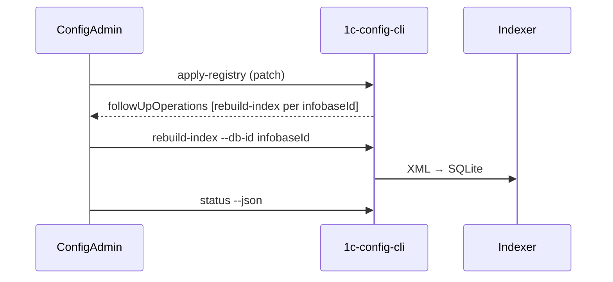

# Agreed mapping: Hub ↔ config-mcp registry

**Status:** agreed **2026-06-28** (ConfigAdmin / Admin Hub + 1c-config-mcp)  
**Canon:** this file in repository `1c-admin-tool`; in config-mcp — link to commit or copy.

**Negotiation archive:**

- [config-mcp responses](registry-mapping-config-mcp-response-2026-06-28.md)
- [Hub response](registry-mapping-hub-response-2026-06-28.md)

**Related documents:** [`integration.md`](integration.md), [`protocol-v1.0.2-addendum.md`](protocol-v1.0.2-addendum.md) §10, §13, target model — [`../domain-model.md`](../domain-model.md).

---

## Summary

- **config-mcp `project`** — operational container (`projects.json`): indexes, `active`, `project_filter` in MCP. **Target mapping 1:1 with Hub Client** (`clientId` in fragment). JSON name `project` is **not renamed**.
- **config-mcp `database`** — **one export** (main config or one extension) → one `.db` index. Not "entire 1C infobase".
- **Hub `projects` (SQLite)** — internal Hub entity; **not materialized** into `projects.json` by default.
- **`infobaseId` in fragment** — **database registry id** = export id in Hub (`ConfigurationExport.id`). Do not confuse with `Infobase.id` (1C infobase connection).
- **R1 (current code):** manual link, `projectId` on infobase, fragment 1:1:1 main config only — **transitional**, not target.
- **Target fragment:** one project per Client, N `databases[]`, mode `patch` after each export.
- **Full E2E** (export → apply → rebuild → index): Hub **H6** — config-mcp P0 CLI **ready** (2026-06-29); Hub orchestration not started.

---

## Terminology table

| Hub term | config-mcp term | Relationship | Note |
|----------|-----------------|--------------|------|
| **Client** | `projects[]` (element) | **1:1** (target) | `clientId` on project; `name` — for humans and `project_filter` |
| **Infobase** | no separate entity | 1:N | One 1C infobase → 1..N databases (base + extensions) |
| **ConfigurationExport** | `database` (`source_path`, `source_kind`) | **1:1** | `infobaseId` in fragment = export id |
| **ConfigurationTemplate** (future) | `database.type` + `name` (+ optional metadata) | N:1 | Separate table in config-mcp not needed |
| **Hub `projects`** (SQLite, §10) | no analogue | — | Internal; not UI "development project" |
| **Task** | none | — | Hub / meta-MCP only |

**Exception:** one Hub Client may have **2 config-mcp projects** (prod/dev, archive) — explicit mode, not default.

---

## Identifiers and ownership

| Fragment field | Where stored in Hub (target) | Rule |
|----------------|------------------------------|------|
| `clientId` | `clients.id` | Required |
| `projectId` | `clients.config_mcp_project_id` | Stable UUID on first sync; ≠ `clientId` allowed |
| `infobaseId` | `ConfigurationExport.id` | One id per export (base / extension) |

**Deprecated (R1):** `infobases.config_mcp_project_id`, manual link "infobase → MCP project" in UI (remains only for second MCP container).

**Reconcile:** if portable already has project with same `clientId` — upsert, do not duplicate.

**v1.0.2 §10:** Hub — authoritative for UUID lifecycle; config-mcp — materialized view, upsert by `projectId` / `infobaseId`.

---

## Fragment `apply-registry`

### Required fields

| Field | Level |
|-------|-------|
| `projectId` | project |
| `clientId` | project |
| `infobaseId` | database |
| `name` | project, database |
| `sourcePath` + `sourceKind` | database (when updating source) |
| `type` (`base` \| `extension`) | database on create |

### Recommended

`active`, `platformVersion`.

### Observational (not master for apply)

`indexStatus`, `contentHash` — Hub/UI; config-mcp owns mtime and local index.

### `sourceKind`

- **`directory`** — canon (directory with `Configuration.xml`).
- **`archive`** — Hub does not send until config-mcp support.

### Granularity

- After export: **patch** with changed `databases[]`.
- Periodically: full client fragment for reconcile.
- Do not require full snapshot after every export.

### Example (client "Ромашка")

```
project: projectId, clientId, name="Ромашка", active=true
databases[]:
  { infobaseId: <export-id>, name: "Бухгалтерия prod",       type: base,      sourcePath: …/Основная конфигурация }
  { infobaseId: <export-id>, name: "Бухгалтерия prod / ФТ1", type: extension, sourcePath: …/Расширение1/… }
  …
```

---

## Workflow export → index



- **Rebuild initiator:** Hub (H6, Phase 3).
- **One rebuild** per database (`infobaseId` = export id).
- **Queue:** no two rebuilds on one database; 1–2 concurrent on different databases.
- **Now:** apply + automatic rebuild (H6, 2026-06-30). E2E: extension + hub-first link.

Hub **does not write** to registry: `db_file`, `.db`, `.building`, `.tmp`, locks, `source_xml`.

---

## UI and naming

| Where | Label |
|-------|-------|
| config-mcp GUI | "Проект" (no rename) |
| Hub UI (target) | "MCP container", "config-mcp index (client)" — not "development project" |
| Hub workspace | Client → Infobase → Template → Task (see concept) |

Breaking rename of `projects` / `projects.json` **not planned** on either side.

---

## Current implementation vs target (R1 → R2)

| Aspect | R1 (now) | Target |
|--------|----------|--------|
| `projectId` | `infobases.config_mcp_project_id` | `clients.config_mcp_project_id` |
| Fragment | 1 project, 1 database, main config | 1 project (Client), N databases |
| `infobaseId` in fragment | `ConfigurationExport.id` | `ConfigurationExport.id` |
| Linking | Manual on MCP screen (instance-level) | Auto-sync by Client |
| Rebuild | Hub orchestration (H6) **done** | Hub orchestration (H6) |

R1 code: `src/ConfigAdmin.Application/Hub/ConfigMcpFragmentBuilder.cs`.

---

## Hub backlog (registry R2 + Phase 3)

| ID | Task | Dependency |
|----|------|------------|
| H1 | `config_mcp_project_id` on Client, auto-assign | SQLite schema |
| H2 | Fragment: Client + N databases | H3 |
| H3 | Export pipeline: id and path on base + extensions | — |
| H4 | Deprecate manual link (except 2-container) | H1 |
| H5 | This document | **done** |
| H6 | Orchestration `rebuild-index` | **done** (Hub, 2026-06-30) |
| H7 | UI: "MCP container" instead of "MCP Project" | — |

Backlog: [`../todo.md`](../todo.md).

---

## config-mcp backlog (agreed by them)

| Priority | Task | Status |
|----------|------|--------|
| **P0** | CLI `rebuild-index`, `rebuild-all`, `reconcile-markers` | **done** (2026-06-29) |
| **P1** | `status --json` readiness (`indexReadiness`) per database | **done** (2026-06-29) |
| — | `operations.log` (append-only audit) | config-mcp backlog |
| — | Multi-database fragment from Hub (apply already ready) | — |

---

*Update this file when the contract changes; party responses — only in archive `registry-mapping-*-response-*.md`.*
