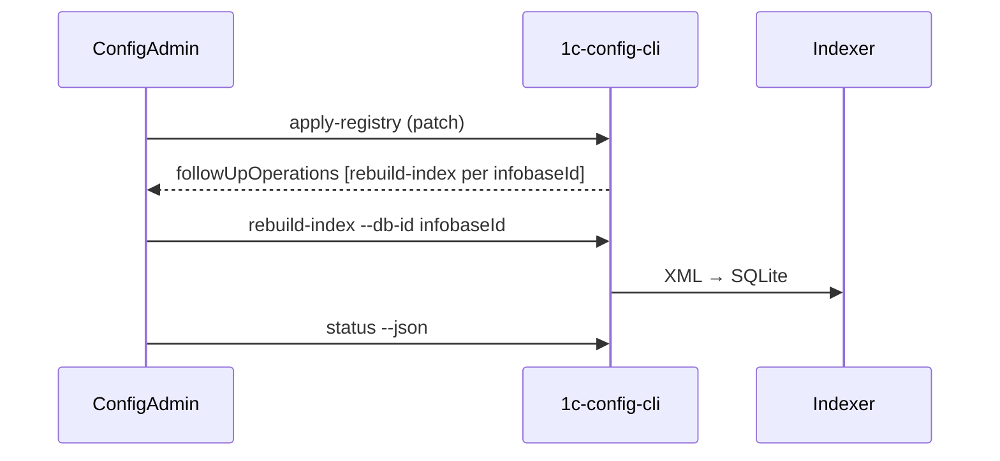

# Согласованный mapping: Hub ↔ config-mcp registry

**Статус:** agreed **2026-06-28** (ConfigAdmin / Admin Hub + 1c-config-mcp)  
**Канон:** этот файл в репозитории `1c-admin-tool`; в config-mcp — ссылка на commit или копия.

**Архив переговоров:**

- [Ответы config-mcp](registry-mapping-config-mcp-response-2026-06-28.md)
- [Ответ Hub](registry-mapping-hub-response-2026-06-28.md)

**Связанные документы:** [`integration.md`](integration.md), [`protocol-v1.0.2-addendum.md`](protocol-v1.0.2-addendum.md) §10, §13, целевая модель — [`../domain-model.md`](../domain-model.md).

---

## Резюме

- **config-mcp `project`** — operational-контейнер (`projects.json`): индексы, `active`, `project_filter` в MCP. **Целевой mapping 1:1 с Hub Client** (`clientId` в fragment). Имя `project` в JSON **не переименовываем**.
- **config-mcp `database`** — **одна выгрузка** (основная конфа или одно расширение) → один индекс `.db`. Не «инфобаза 1С целиком».
- **Hub `projects` (SQLite)** — внутренняя сущность Hub; **не материализуется** в `projects.json` по умолчанию.
- **Поле `infobaseId` в fragment** — **database registry id** = id выгрузки в Hub (`ConfigurationExport.id`). Не путать с `Infobase.id` (подключение к базе 1С).
- **R1 (текущий код):** ручной линк, `projectId` на infobase, fragment 1:1:1 только основная конфа — **переходный**, не целевой.
- **Целевой fragment:** один project на Client, N `databases[]`, mode `patch` после каждого export.
- **Полный E2E** (export → apply → rebuild → index): Hub **H6** — config-mcp P0 CLI **готов** (2026-06-29); orchestration на Hub не начато.

---

## Таблица терминов

| Термин Hub | Термин config-mcp | Соотношение | Примечание |
|------------|-------------------|-------------|------------|
| **Client** | `projects[]` (элемент) | **1:1** (целевое) | `clientId` на project; `name` — для людей и `project_filter` |
| **Infobase** | нет отдельной сущности | 1:N | Одна инфобаза 1С → 1..N databases (base + extensions) |
| **ConfigurationExport** | `database` (`source_path`, `source_kind`) | **1:1** | `infobaseId` в fragment = export id |
| **ConfigurationTemplate** (будущее) | `database.type` + `name` (+ optional metadata) | N:1 | Отдельная таблица в config-mcp не нужна |
| **Hub `projects`** (SQLite, §10) | нет аналога | — | Внутреннее; не UI «проект разработки» |
| **Task** | нет | — | Только Hub / meta-MCP |

**Исключение:** у одного Hub Client может быть **2 config-mcp project** (prod/dev, архив) — явный режим, не дефолт.

---

## Идентификаторы и ownership

| Поле fragment | Где хранится в Hub (целевое) | Правило |
|---------------|------------------------------|---------|
| `clientId` | `clients.id` | Обязательно |
| `projectId` | `clients.config_mcp_project_id` | Стабильный UUID при первом sync; ≠ `clientId` допустимо |
| `infobaseId` | `ConfigurationExport.id` | Один id на каждый export (base / extension) |

**Deprecated (R1):** `infobases.config_mcp_project_id`, ручной линк «база → MCP project» в UI (остаётся только для второго MCP-контейнера).

**Reconcile:** если в portable уже есть project с тем же `clientId` — upsert, не дублировать.

**v1.0.2 §10:** Hub — authoritative для lifecycle UUID; config-mcp — materialized view, upsert по `projectId` / `infobaseId`.

---

## Fragment `apply-registry`

### Обязательные поля

| Поле | Уровень |
|------|---------|
| `projectId` | project |
| `clientId` | project |
| `infobaseId` | database |
| `name` | project, database |
| `sourcePath` + `sourceKind` | database (при обновлении источника) |
| `type` (`base` \| `extension`) | database при create |

### Рекомендуемые

`active`, `platformVersion`.

### Observational (не master для apply)

`indexStatus`, `contentHash` — Hub/UI; config-mcp владеет mtime и локальным индексом.

### `sourceKind`

- **`directory`** — канон (каталог с `Configuration.xml`).
- **`archive`** — Hub не шлёт до поддержки config-mcp.

### Гранулярность

- После export: **patch** с изменёнными `databases[]`.
- Периодически: полный fragment клиента для reconcile.
- Не требовать полный snapshot после каждого export.

### Пример (клиент «Ромашка»)

```
project: projectId, clientId, name="Ромашка", active=true
databases[]:
  { infobaseId: <export-id>, name: "Бухгалтерия prod",       type: base,      sourcePath: …/Основная конфигурация }
  { infobaseId: <export-id>, name: "Бухгалтерия prod / ФТ1", type: extension, sourcePath: …/Расширение1/… }
  …
```

---

## Workflow export → index



- **Инициатор rebuild:** Hub (H6, Phase 3).
- **Один rebuild** на одну database (`infobaseId` = export id).
- **Очередь:** не два rebuild на одну database; 1–2 concurrent на разные databases.
- **Сейчас:** apply + автоматический rebuild (H6, 2026-06-30). E2E: extension + hub-first link.

Hub **не пишет** в registry: `db_file`, `.db`, `.building`, `.tmp`, locks, `source_xml`.

---

## UI и именование

| Где | Как называть |
|-----|----------------|
| config-mcp GUI | «Проект» (без rename) |
| Hub UI (целевое) | «MCP-контейнер», «Индекс config-mcp (клиент)» — не «проект разработки» |
| Рабочая область Hub | Client → Infobase → Template → Task (см. концепт) |

Breaking rename `projects` / `projects.json` **не планируется** ни на одной стороне.

---

## Текущая реализация vs целевое (R1 → R2)

| Аспект | R1 (сейчас) | Целевое |
|--------|-------------|---------|
| `projectId` | `infobases.config_mcp_project_id` | `clients.config_mcp_project_id` |
| Fragment | 1 project, 1 database, основная конфа | 1 project (Client), N databases |
| `infobaseId` в fragment | `ConfigurationExport.id` | `ConfigurationExport.id` |
| Линковка | Ручная на экране MCP (instance-level) | Auto-sync по Client |
| Rebuild | Hub orchestration (H6) **готово** | Hub orchestration (H6) |

Код R1: `src/ConfigAdmin.Application/Hub/ConfigMcpFragmentBuilder.cs`.

---

## Backlog Hub (registry R2 + Phase 3)

| ID | Задача | Зависимость |
|----|--------|-------------|
| H1 | `config_mcp_project_id` на Client, auto-assign | схема SQLite |
| H2 | Fragment: Client + N databases | H3 |
| H3 | Export pipeline: id и path на base + extensions | — |
| H4 | Deprecate ручной линк (кроме 2-container) | H1 |
| H5 | Этот документ | **done** |
| H6 | Orchestration `rebuild-index` | **готово** (Hub, 2026-06-30) |
| H7 | UI: «MCP-контейнер» вместо «MCP Project» | — |

Backlog: [`../todo.md`](../todo.md).

---

## Backlog config-mcp (согласовано ими)

| Приоритет | Задача | Статус |
|-----------|--------|--------|
| **P0** | CLI `rebuild-index`, `rebuild-all`, `reconcile-markers` | **готово** (2026-06-29) |
| **P1** | `status --json` readiness (`indexReadiness`) per database | **готово** (2026-06-29) |
| — | `operations.log` (append-only audit) | backlog config-mcp |
| — | Multi-database fragment от Hub (apply уже готов) | — |

---

*Обновлять этот файл при изменении контракта; ответы сторон — только в архивных `registry-mapping-*-response-*.md`.*
